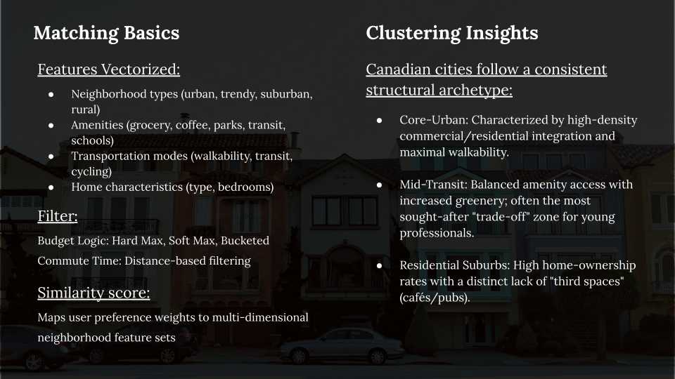

# Canada-Wide Neighborhood Recommendation Engine

The Canada-Wide Neighborhood Recommendation Engine covers **3,633 neighborhoods**, helping homebuyers quantify lifestyle trade-offs across competing criteria. 

### Methodology and Logic
Each neighborhood and user profile is represented as a feature vector across **20+ dimensions** sourced from **Local Logic** and **MLS APIs**: 
* Neighborhood types: urban, trendy, suburban, and rural.
* Amenity density: grocery, coffee, parks, transit, and schools.
* Transportation modes: walkability, cycling, and driving.
* Home characteristics.

Although I built and tested autoencoder representations, the regulatory environment made the choice clear: black-box neural embeddings require compliance reviews that would have blocked production in a regulated financial institution. Similarity is instead computed as a **weighted dot product** normalized 0 to 100%. Top contributing features are extracted per recommendation so risk, legal, and product teams can directly audit what drove each match.

### Budget and Filtering
Budget handling operates in three modes:
* **Hard budget ceiling**: A strict cutoff.
* **Soft penalty**: A $\lambda$-weighted decay function.
* **Bucketed system**: Affordable, stretch, and unaffordable tiers.

Commute filtering uses distance-based calculations from a user-entered origin.

### Clustering Insights
K-means and t-SNE clustering revealed consistent Canadian urban archetypes:
* **Core-Urban**: High-density commercial integration and maximal walkability.
* **Mid-Transit**: Balanced amenity access, often most sought-after by young professionals.
* **Residential Suburbs**: High home-ownership with a distinct lack of third spaces like cafés and pubs.

### Data Engineering
A core data engineering challenge involved sourcing the data: MLS and Local Logic boundaries had no 1 to 1 relationship. I resolved this by querying the most specific Local Logic neighborhood per MLS boundary using lat/long points. I designed a caching layer to avoid redundant API calls and determined refresh intervals, production decisions I drove independently.

---

